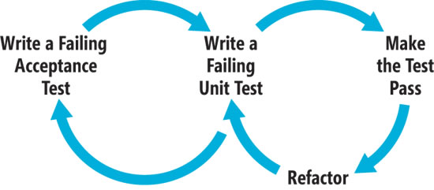

cukeJava
========

"Software delivery is about writing software to achieve business outcomes. It sounds obvious, but often political or environmental factors distract us from remembering this. Sometimes software delivery can appear to be about producing optimistic reports to keep senior management happy, or just creating “busy work” to keep people in paid employment, but that’s a topic for another day.

Usually, the business outcomes are too coarse-grained to be used to directly write software (where do you start coding when the outcome is “save 5% of my operating costs”?) so we need to define requirements at some intermediate level in order to get work done.

Behaviour-driven development (BDD) takes the position that you can turn an idea for a requirement into implemented, tested, production-ready code simply and effectively, as long as the requirement is specific enough that everyone knows what’s going on. To do this, we need a way to describe the requirement such that everyone – the business folks, the analyst, the developer and the tester – have a common understanding of the scope of the work. From this they can agree a common definiton of “done”, and we escape the dual gumption traps of “that’s not what I asked for” or “I forgot to tell you about this other thing”."  http://buff.ly/1qAmVLP

### What is Behavior Driven Development?

Behavior Driven Development (which we will now refer to as "BDD") follows on from the ideas and principles introduced in Test Driven Development. The key points of writing tests before code really apply to BDD as well. The idea is to not only test your code at the granular level with unit tests, but also test your application end to end, using acceptance tests. We will introduce this style of testing with the use of the Freshen testing framework.

_Behavior Driven Development (BDD) is a subset of Test Driven Development (TDD)._

The process can be simply defined as:

- Write a failing acceptance test
- Write a failing unit test
- Make the unit test pass
- Refactor
- Make the acceptance test pass

Rinse and repeat for every feature, as is necessary.

BDD in Java using Cucumber within Eclipse. How much more fun can [testing][cukedoc] get? Thanks to the information provided by the folks at Merley, the [instructions][guide] really helped.

Expanded the initial scope to include a String Calculator, based on [jexl][jexl_video]. A convenient image file of the related artifacts is available [here](helloworld/img/CalculatorCapture.PNG)

Must expand this to use this [repo](https://github.com/uklimaschewski/EvalEx.git) both for Java and C++ versions.
Also, this is a good [exercise][grails-spring-cucumber-BDD] as well as a final year project (when expanded to cover Spring) as well.

### Links to start Reading
- Imperative vs Declarative Scenarios in User Stories • Ben Mabey http://buff.ly/1vaec9A
  - Verifying Web Applications: From Business Level Specifications to Automated Model-Based Testing http://buff.ly/1DIBVSg
- The Truth about BDD - Clean Coder http://buff.ly/1rnpYeh
- [TOC][TOC]
  - Start at the [Home](https://github.com/cucumber/cucumber/wiki)
- [Feature Introduction][Feature]

[guide]: http://www.merleysoftware.co.uk/uploads/1/7/4/3/17436105/eclipse_maven_cucumber_setup.doc
[jexl_video]: http://buff.ly/1vaqJJc
[cukedoc]: https://github.com/cucumber/cucumber/wiki/Cucumber-Backgrounder#or-how-i-learned-to-stop-worrying-and-love-testing-start-behaving 
[TOC]: https://github.com/cucumber/cucumber/wiki/A-Table-Of-Content
[Feature]: https://github.com/cucumber/cucumber/wiki/Feature-Introduction
[grails-spring-cucumber-BDD]: https://www.youtube.com/watch?v=tezwRwdb2vE  "BDD Cucumber JVM Groovy Spring"
